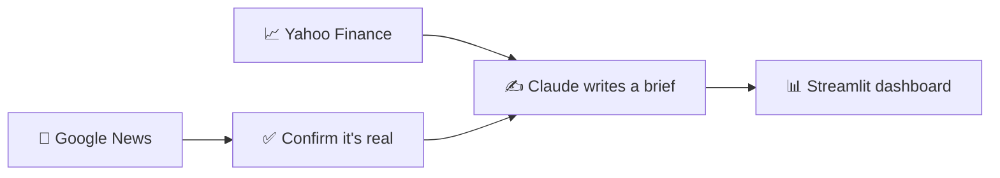

# Product Launch Tracker

**[🔗 Live app](https://tech-launch-newsfeed.streamlit.app/)**

A daily-refreshing dashboard that tracks NASDAQ-100 companies for real
product-launch news, cross-checks it against multiple sources before
treating it as confirmed, and turns each confirmed launch into a short,
readable brief with a stock snapshot.

## What it does

- Watches all 100 NASDAQ-100 companies for product-launch news every day
- Only surfaces a launch once it's been reported by two independent sources
  (or one major wire service), filtering out noise like earnings reports
  and routine press releases
- Auto-generates a plain-language summary and stock snapshot for each
  confirmed launch
- Presents everything in a simple, browsable dashboard — pick a date, pick
  a company, read the brief

## How it works

1. **Google News** — each company is checked daily against recent news
   coverage.
2. **Confirm it's real** — a launch only counts once it's corroborated by
   multiple outlets, filtering out routine financial news.
3. **Claude writes a brief** — Claude generates a short, plain-language
   summary, paired with a stock snapshot (price, 1-year change, 52-week
   range) pulled from Yahoo Finance.
4. **Streamlit dashboard** — everything is published to the live app
   above automatically, no manual updates.

## Built with

Python · Streamlit · Google News · Yahoo Finance data · Claude (Anthropic)

## Feedback loop

A feedback form on the dashboard files every submission as a GitHub issue. Each one is
triaged (manually, via a Claude Code skill): concrete bugs or feature requests that add value
get a local implementation proposal drafted for review; low-value requests are auto-closed
with a standard reply; general questions get a drafted answer staged for approval before
posting. Nothing is posted to GitHub or acted on without an explicit review step.

## **New component (WIP):** Self-Service NL Analytics

An app where a non-technical user types a plain-English question about NASDAQ-100 product launches, and the system checks whether it has answered something similar before, translates the question into a governed metric query (not raw SQL), lets MetricFlow compile and run guaranteed-correct SQL, and returns an answer plus an auto-chosen chart — while always showing its work.

## A note on the content

This is not investment advice. The stock data shown is historical/current
only — no forecasts, and no claim that a launch caused any price movement.
